Exploratory Data Analysis
================

## Paul Nguyen & David Herrero-Quevedo

``` r
#load necessary libraries
library(nbastatR)
library(tidyverse)
library(BBmisc)
library(ggplot2)
library(dplyr)
library(corrplot)
library(gganimate)
```

## Data Description

### Provenance

We obtained our datasets from basketball-reference.com and
stats.nba.com. We used the R package `nbastatR` to obtain the data from
those websites.

``` r
# Gets player stats from 1984 to 2020.
players_post1984 <- bref_players_stats(seasons = 1984:2020, tables = c("advanced", "per_game"), include_all_nba = TRUE)
```

    ## parsed http://www.basketball-reference.com/leagues/NBA_1984_advanced.html
    ## parsed http://www.basketball-reference.com/leagues/NBA_1985_advanced.html
    ## parsed http://www.basketball-reference.com/leagues/NBA_1986_advanced.html
    ## parsed http://www.basketball-reference.com/leagues/NBA_1987_advanced.html
    ## parsed http://www.basketball-reference.com/leagues/NBA_1988_advanced.html
    ## parsed http://www.basketball-reference.com/leagues/NBA_1989_advanced.html
    ## parsed http://www.basketball-reference.com/leagues/NBA_1990_advanced.html
    ## parsed http://www.basketball-reference.com/leagues/NBA_1991_advanced.html
    ## parsed http://www.basketball-reference.com/leagues/NBA_1992_advanced.html
    ## parsed http://www.basketball-reference.com/leagues/NBA_1993_advanced.html
    ## parsed http://www.basketball-reference.com/leagues/NBA_1994_advanced.html
    ## parsed http://www.basketball-reference.com/leagues/NBA_1995_advanced.html
    ## parsed http://www.basketball-reference.com/leagues/NBA_1996_advanced.html
    ## parsed http://www.basketball-reference.com/leagues/NBA_1997_advanced.html
    ## parsed http://www.basketball-reference.com/leagues/NBA_1998_advanced.html
    ## parsed http://www.basketball-reference.com/leagues/NBA_1999_advanced.html
    ## parsed http://www.basketball-reference.com/leagues/NBA_2000_advanced.html
    ## parsed http://www.basketball-reference.com/leagues/NBA_2001_advanced.html
    ## parsed http://www.basketball-reference.com/leagues/NBA_2002_advanced.html
    ## parsed http://www.basketball-reference.com/leagues/NBA_2003_advanced.html
    ## parsed http://www.basketball-reference.com/leagues/NBA_2004_advanced.html
    ## parsed http://www.basketball-reference.com/leagues/NBA_2005_advanced.html
    ## parsed http://www.basketball-reference.com/leagues/NBA_2006_advanced.html
    ## parsed http://www.basketball-reference.com/leagues/NBA_2007_advanced.html
    ## parsed http://www.basketball-reference.com/leagues/NBA_2008_advanced.html
    ## parsed http://www.basketball-reference.com/leagues/NBA_2009_advanced.html
    ## parsed http://www.basketball-reference.com/leagues/NBA_2010_advanced.html
    ## parsed http://www.basketball-reference.com/leagues/NBA_2011_advanced.html
    ## parsed http://www.basketball-reference.com/leagues/NBA_2012_advanced.html
    ## parsed http://www.basketball-reference.com/leagues/NBA_2013_advanced.html
    ## parsed http://www.basketball-reference.com/leagues/NBA_2014_advanced.html
    ## parsed http://www.basketball-reference.com/leagues/NBA_2015_advanced.html
    ## parsed http://www.basketball-reference.com/leagues/NBA_2016_advanced.html
    ## parsed http://www.basketball-reference.com/leagues/NBA_2017_advanced.html
    ## parsed http://www.basketball-reference.com/leagues/NBA_2018_advanced.html
    ## parsed http://www.basketball-reference.com/leagues/NBA_2019_advanced.html
    ## parsed http://www.basketball-reference.com/leagues/NBA_2020_advanced.html
    ## parsed http://www.basketball-reference.com/leagues/NBA_1984_per_game.html
    ## parsed http://www.basketball-reference.com/leagues/NBA_1985_per_game.html
    ## parsed http://www.basketball-reference.com/leagues/NBA_1986_per_game.html
    ## parsed http://www.basketball-reference.com/leagues/NBA_1987_per_game.html
    ## parsed http://www.basketball-reference.com/leagues/NBA_1988_per_game.html
    ## parsed http://www.basketball-reference.com/leagues/NBA_1989_per_game.html
    ## parsed http://www.basketball-reference.com/leagues/NBA_1990_per_game.html
    ## parsed http://www.basketball-reference.com/leagues/NBA_1991_per_game.html
    ## parsed http://www.basketball-reference.com/leagues/NBA_1992_per_game.html
    ## parsed http://www.basketball-reference.com/leagues/NBA_1993_per_game.html
    ## parsed http://www.basketball-reference.com/leagues/NBA_1994_per_game.html
    ## parsed http://www.basketball-reference.com/leagues/NBA_1995_per_game.html
    ## parsed http://www.basketball-reference.com/leagues/NBA_1996_per_game.html
    ## parsed http://www.basketball-reference.com/leagues/NBA_1997_per_game.html
    ## parsed http://www.basketball-reference.com/leagues/NBA_1998_per_game.html
    ## parsed http://www.basketball-reference.com/leagues/NBA_1999_per_game.html
    ## parsed http://www.basketball-reference.com/leagues/NBA_2000_per_game.html
    ## parsed http://www.basketball-reference.com/leagues/NBA_2001_per_game.html
    ## parsed http://www.basketball-reference.com/leagues/NBA_2002_per_game.html
    ## parsed http://www.basketball-reference.com/leagues/NBA_2003_per_game.html
    ## parsed http://www.basketball-reference.com/leagues/NBA_2004_per_game.html
    ## parsed http://www.basketball-reference.com/leagues/NBA_2005_per_game.html
    ## parsed http://www.basketball-reference.com/leagues/NBA_2006_per_game.html
    ## parsed http://www.basketball-reference.com/leagues/NBA_2007_per_game.html
    ## parsed http://www.basketball-reference.com/leagues/NBA_2008_per_game.html
    ## parsed http://www.basketball-reference.com/leagues/NBA_2009_per_game.html
    ## parsed http://www.basketball-reference.com/leagues/NBA_2010_per_game.html
    ## parsed http://www.basketball-reference.com/leagues/NBA_2011_per_game.html
    ## parsed http://www.basketball-reference.com/leagues/NBA_2012_per_game.html
    ## parsed http://www.basketball-reference.com/leagues/NBA_2013_per_game.html
    ## parsed http://www.basketball-reference.com/leagues/NBA_2014_per_game.html
    ## parsed http://www.basketball-reference.com/leagues/NBA_2015_per_game.html
    ## parsed http://www.basketball-reference.com/leagues/NBA_2016_per_game.html
    ## parsed http://www.basketball-reference.com/leagues/NBA_2017_per_game.html
    ## parsed http://www.basketball-reference.com/leagues/NBA_2018_per_game.html
    ## parsed http://www.basketball-reference.com/leagues/NBA_2019_per_game.html
    ## parsed http://www.basketball-reference.com/leagues/NBA_2020_per_game.html
    ## Advanced
    ## Assigning NBA player dictionary to df_dict_nba_players to your environment
    ## PerGame

``` r
# Filters by amount of time they played.
ggplot(players_post1984, mapping = aes(x = minutes)) + 
   geom_histogram() +
   geom_vline(xintercept = 600)
```

<!-- -->

``` r
 players_post1984 <- filter(players_post1984, minutes > 600)

 # Variables to drop
dropping <-c("slugSeason", "idPlayerNBA", "namePlayerBREF", "urlPlayerBREF",
             "slugPlayerBREF", "urlPlayerThumbnail", "urlPlayerHeadshot",
             "slugPosition","urlPlayerPhoto", "urlPlayerStats",
             "urlPlayerActionPhoto","yearSeasonFirst",
             "countTeamsPlayerSeason","countGamesStarted",
             "isSeasonCurrent","slugPlayerSeason", "agePlayer",
             "slugTeamBREF", "isHOFPlayer", "slugTeamsBREF", 
             "countTeamsPlayerSeasonPerGame", "groupAllNBA",
             "numberAllNBATeam", "isAllNBA2", "isAllNBA1",
             "isAllNBA3" )
# Dropping variables
players_post1984 <- players_post1984[,!(names(players_post1984) %in% dropping)]

# Groups players by season, and normalizes by season.
for(year in 1984:2020){
  eval(parse(text = paste( "players_",year," <- filter(players_post1984, yearSeason == ",year,")", sep = "" )))
  for(i in 6:48){
    eval(parse(text = paste( "players_",year,"[,",i,"] <- normalize(players_",year,"[,",i,"],method = 'range', range = c(0,1))", sep = "")))
  }
}

# Ungroups players by season.
players_post1984_normalized <- players_1984
for(year in 1985:2020){
  eval(parse(text = paste( "players_post1984_normalized <- rbind(players_post1984_normalized, players_",year,")", sep = "")))
}
```

### Unit of observation and Variables

Our unit of observation is a player during one season. Our original
dataset consists of 21235 observations and 75 variables, but we’ve
reduced this number to 10223 observations after selecting seasons after
1983 and players that have played in at least 600 minutes in the season.
We’ve also taken out some unnecessary variables to make a 11695
observation, 49 variable dataset. We have included descriptions of the
variables at the bottom of the page.

## Data Exploration

``` r
library(dplyr)
library(ggplot2)
#some summary statistics
summarystatistics1984 <- players_post1984 %>%
  group_by(yearSeason, groupPosition) %>%
  summarize(meanpctFTRate = mean(pctFTRate),
            meanpct3PRate = mean(pct3PRate),
            meanpctFG = mean(pctFG),
            meanpctFG3 = mean(pctFG3),
            meanpctFG2 = mean(pctFG2),
            meanpctEFG = mean(pctEFG),
            meanpctFT = mean(pctFT),
            meanfgmPerGame = mean(fgmPerGame),
            meanfgaPerGame = mean(fgaPerGame),
            meanfg3mPerGame = mean(fg3mPerGame),
            meanfg3aPerGame = mean(fg3aPerGame),
            meanfg2mPerGame = mean(fg2mPerGame),
            meanfg2aPerGame = mean(fg2aPerGame),
            meanftmPerGame = mean(ftmPerGame),
            meanftaPerGame = mean(ftaPerGame),
            meanptsPerGame = mean(ptsPerGame),
            meanpctORB = mean(pctORB),
            meanpctTRB = mean(pctTRB),
            meanpctDRB = mean(pctDRB),
            meanorbPerGame = mean(orbPerGame),
            meandrbPerGame = mean (drbPerGame),
            meantrbPerGame = mean(trbPerGame),
            meanpctAST = mean(pctAST),
            meanpctTOV = mean(pctTOV),
            meanastPerGame = mean(astPerGame),
            meantovPerGame = mean(tovPerGame),
            meanpctSTL = mean(pctSTL),
            meanpctBLK = mean(pctBLK),
            meanstlPerGame = mean(stlPerGame),
            meanblkPerGame = mean(blkPerGame),
            meanpfPerGame = mean(pfPerGame),
            meanratioOWS = mean(ratioOWS),
            meanratioDWS = mean(ratioDWS),
            meanratioWS = mean(ratioWS),
            meanratioWSPer48 = mean(ratioWSPer48),
            meanratioOBPM = mean(ratioOBPM),
            meanratioDBPM = mean(ratioDBPM),
            meanratioBPM = mean(ratioBPM),
            meanratioVORP = mean(ratioVORP),
            sdpctFTRate = sd(pctFTRate),
            sdpct3PRate = sd(pct3PRate),
            sdpctFG = sd(pctFG),
            sdpctFG3 = sd(pctFG3),
            sdpctFG2 = sd(pctFG2),
            sdpctEFG = sd(pctEFG),
            sdpctFT = sd(pctFT),
            sdfgmPerGame = sd(fgmPerGame),
            sdfgaPerGame = sd(fgaPerGame),
            sdfg3mPerGame = sd(fg3mPerGame),
            sdfg3aPerGame = sd(fg3aPerGame),
            sdfg2mPerGame = sd(fg2mPerGame),
            sdfg2aPerGame = sd(fg2aPerGame),
            sdftmPerGame = sd(ftmPerGame),
            sdftaPerGame = sd(ftaPerGame),
            sdptsPerGame = sd(ptsPerGame),
            sdpctORB = sd(pctORB),
            sdpctTRB = sd(pctTRB),
            sdpctDRB = sd(pctDRB),
            sdorbPerGame = sd(orbPerGame),
            sddrbPerGame = sd (drbPerGame),
            sdtrbPerGame = sd(trbPerGame),
            sdpctSTL = sd(pctSTL),
            sdpctBLK = sd(pctBLK),
            sdstlPerGame = sd(stlPerGame),
            sdblkPerGame = sd(blkPerGame),
            sdpfPerGame = sd(pfPerGame),
            sdratioOWS = sd(ratioOWS),
            sdratioDWS = sd(ratioDWS),
            sdratioWS = sd(ratioWS),
            sdratioWSPer48 = sd(ratioWSPer48),
            sdratioOBPM = sd(ratioOBPM),
            sdratioDBPM = sd(ratioDBPM),
            sdratioBPM = sd(ratioBPM),
            sdratioVORP = sd(ratioVORP)
            )
head(summarystatistics1984)
```

    ## # A tibble: 6 x 76
    ## # Groups:   yearSeason [2]
    ##   yearSeason groupPosition meanpctFTRate meanpct3PRate meanpctFG meanpctFG3
    ##        <dbl> <chr>                 <dbl>         <dbl>     <dbl>      <dbl>
    ## 1       1984 C                     0.394       0.00437     0.512     0.0709
    ## 2       1984 F                     0.366       0.0154      0.494     0.128 
    ## 3       1984 G                     0.292       0.0497      0.470     0.215 
    ## 4       1985 C                     0.406       0.00487     0.505     0.0232
    ## 5       1985 F                     0.348       0.0202      0.490     0.129 
    ## 6       1985 G                     0.274       0.0665      0.478     0.239 
    ## # … with 70 more variables: meanpctFG2 <dbl>, meanpctEFG <dbl>,
    ## #   meanpctFT <dbl>, meanfgmPerGame <dbl>, meanfgaPerGame <dbl>,
    ## #   meanfg3mPerGame <dbl>, meanfg3aPerGame <dbl>, meanfg2mPerGame <dbl>,
    ## #   meanfg2aPerGame <dbl>, meanftmPerGame <dbl>, meanftaPerGame <dbl>,
    ## #   meanptsPerGame <dbl>, meanpctORB <dbl>, meanpctTRB <dbl>, meanpctDRB <dbl>,
    ## #   meanorbPerGame <dbl>, meandrbPerGame <dbl>, meantrbPerGame <dbl>,
    ## #   meanpctAST <dbl>, meanpctTOV <dbl>, meanastPerGame <dbl>,
    ## #   meantovPerGame <dbl>, meanpctSTL <dbl>, meanpctBLK <dbl>,
    ## #   meanstlPerGame <dbl>, meanblkPerGame <dbl>, meanpfPerGame <dbl>,
    ## #   meanratioOWS <dbl>, meanratioDWS <dbl>, meanratioWS <dbl>,
    ## #   meanratioWSPer48 <dbl>, meanratioOBPM <dbl>, meanratioDBPM <dbl>,
    ## #   meanratioBPM <dbl>, meanratioVORP <dbl>, sdpctFTRate <dbl>,
    ## #   sdpct3PRate <dbl>, sdpctFG <dbl>, sdpctFG3 <dbl>, sdpctFG2 <dbl>,
    ## #   sdpctEFG <dbl>, sdpctFT <dbl>, sdfgmPerGame <dbl>, sdfgaPerGame <dbl>,
    ## #   sdfg3mPerGame <dbl>, sdfg3aPerGame <dbl>, sdfg2mPerGame <dbl>,
    ## #   sdfg2aPerGame <dbl>, sdftmPerGame <dbl>, sdftaPerGame <dbl>,
    ## #   sdptsPerGame <dbl>, sdpctORB <dbl>, sdpctTRB <dbl>, sdpctDRB <dbl>,
    ## #   sdorbPerGame <dbl>, sddrbPerGame <dbl>, sdtrbPerGame <dbl>, sdpctSTL <dbl>,
    ## #   sdpctBLK <dbl>, sdstlPerGame <dbl>, sdblkPerGame <dbl>, sdpfPerGame <dbl>,
    ## #   sdratioOWS <dbl>, sdratioDWS <dbl>, sdratioWS <dbl>, sdratioWSPer48 <dbl>,
    ## #   sdratioOBPM <dbl>, sdratioDBPM <dbl>, sdratioBPM <dbl>, sdratioVORP <dbl>

``` r
ggplot(data = summarystatistics1984, mapping = aes(x = yearSeason, y = meanpctFG, color = groupPosition)) + 
  geom_line()
```

<!-- -->

``` r
#taking a look at some stats over time, grouped by year and position
#fg pct
ggplot(data = summarystatistics1984, 
       mapping = aes(x = yearSeason, y = meanpctFG, color = groupPosition)) +  geom_line()
```

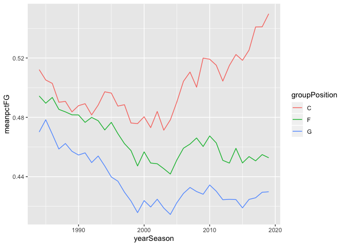<!-- -->

``` r
#3FGPct, see the introduction of 3 point line
ggplot(data = summarystatistics1984, 
       mapping = aes(x = yearSeason, y = meanpctFG3,
                     color = groupPosition)) +
  geom_line()
```

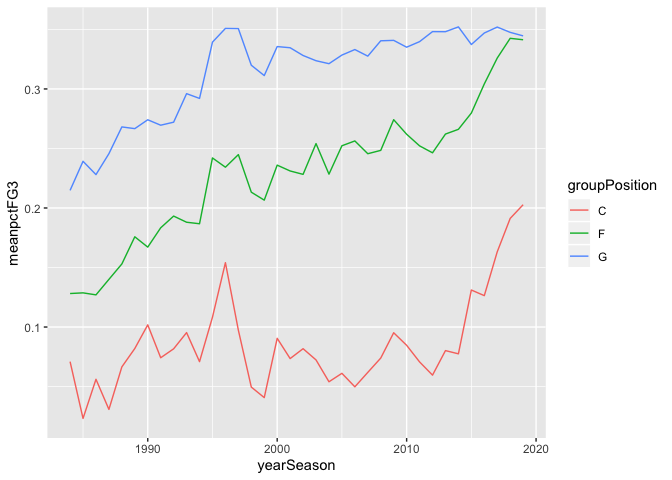<!-- -->

``` r
#meanFGM
ggplot(data = summarystatistics1984, 
       mapping = aes(x = yearSeason, y = meanfgmPerGame,
                     color = groupPosition)) +
  geom_line()
```

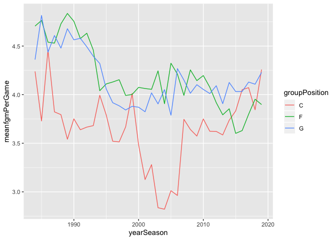<!-- -->

``` r
#meanFGA
ggplot(data = summarystatistics1984, 
       mapping = aes(x = yearSeason, y = meanfgaPerGame,
                     color = groupPosition)) +
  geom_line()
```

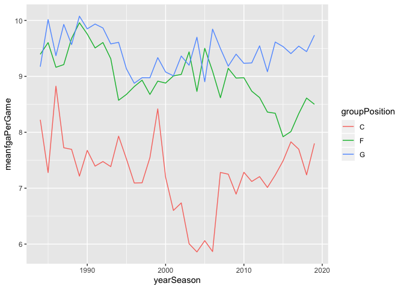<!-- -->

``` r
#mean3FGM 
ggplot(data = summarystatistics1984, 
       mapping = aes(x = yearSeason, y = meanfg3mPerGame,
                     color = groupPosition)) +
  geom_line()
```

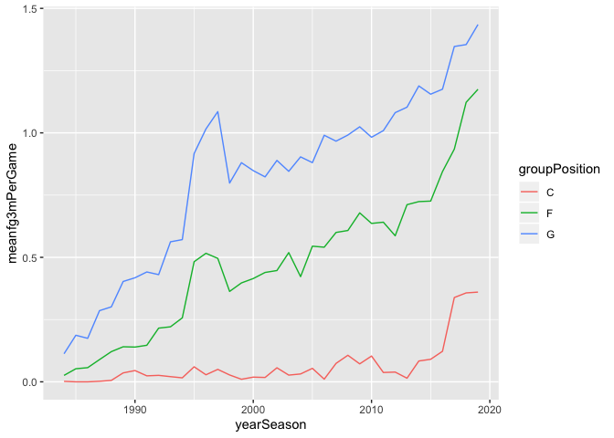<!-- -->

``` r
#mean3FGA
ggplot(data = summarystatistics1984, 
       mapping = aes(x = yearSeason, y = meanfg3aPerGame, color = groupPosition)) +
  geom_line()
```

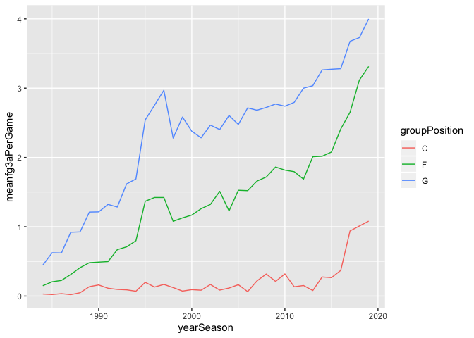<!-- -->

``` r
#meanFTA
ggplot(data = summarystatistics1984, 
       mapping = aes(x = yearSeason, y = meanftaPerGame, 
                     color = groupPosition)) +
  geom_line()
```

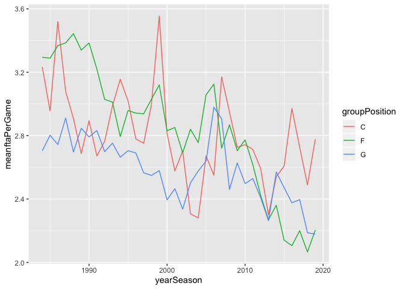<!-- -->

``` r
#meanFTM
ggplot(data = summarystatistics1984, 
       mapping = aes(x = yearSeason, y = meanftmPerGame,
                     color = groupPosition)) +
  geom_line()
```

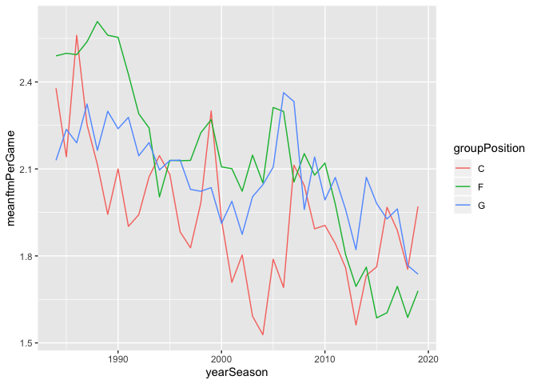<!-- -->

``` r
#meanORB
ggplot(data = summarystatistics1984, 
       mapping = aes(x = yearSeason, y = meanorbPerGame,
                     color = groupPosition)) +
  geom_line()
```

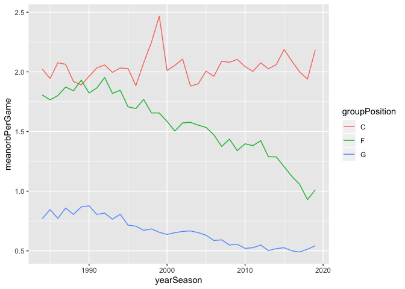<!-- -->

``` r
#meanDRB
ggplot(data = summarystatistics1984, 
       mapping = aes(x = yearSeason, y = meandrbPerGame,
                     color = groupPosition)) +
  geom_line()
```

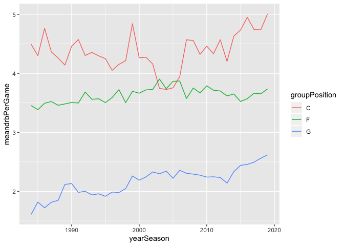<!-- -->

``` r
#meanAST
ggplot(data = summarystatistics1984, 
       mapping = aes(x = yearSeason, y = meanastPerGame, 
                     color = groupPosition)) +
  geom_line()
```

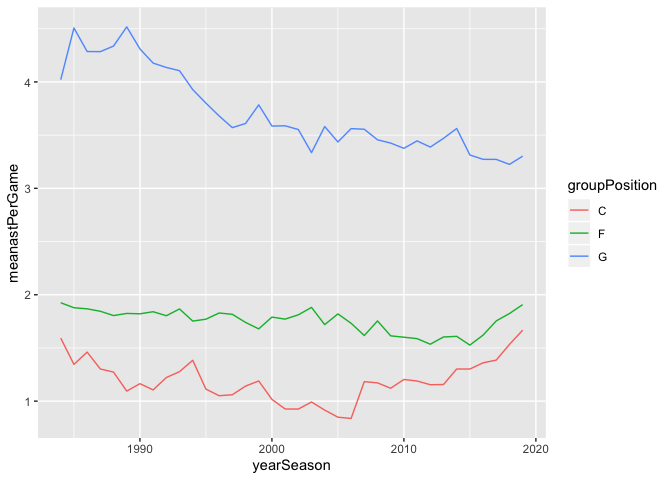<!-- -->

``` r
#meanSTL
ggplot(data = summarystatistics1984, 
       mapping = aes(x = yearSeason, y = meanstlPerGame,
                     color = groupPosition)) +
  geom_line()
```

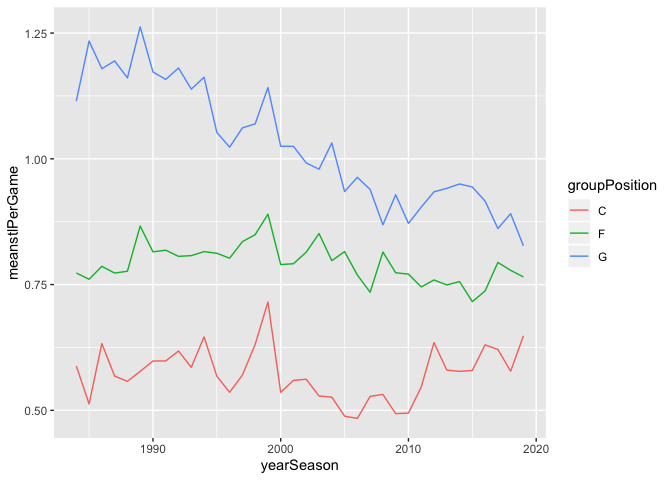<!-- -->

``` r
#meanBLK
ggplot(data = summarystatistics1984, 
       mapping = aes(x = yearSeason, y = meanblkPerGame,
                     color = groupPosition)) +
  geom_line()
```

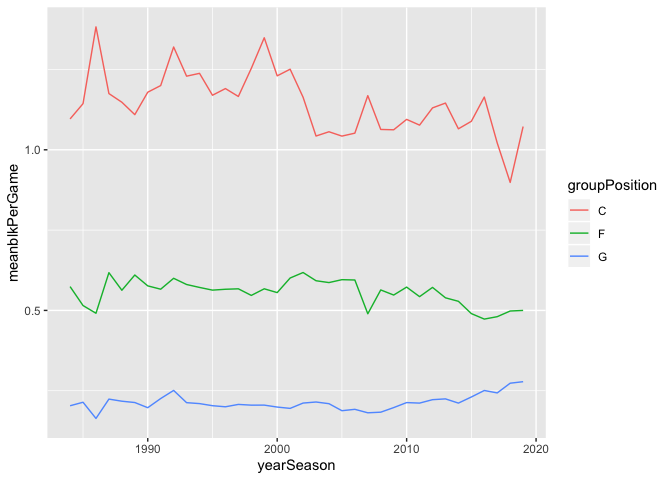<!-- -->

``` r
#meanTOV
ggplot(data = summarystatistics1984, 
       mapping = aes(x = yearSeason, y = meantovPerGame, 
                     color = groupPosition)) +
  geom_line()
```

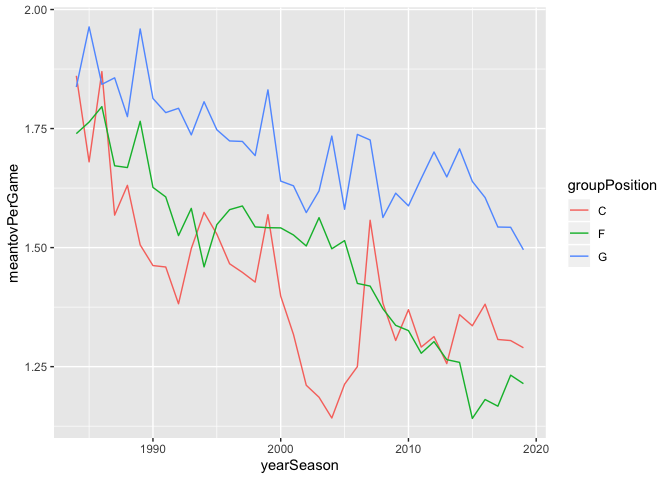<!-- -->

``` r
#meanPTS
ggplot(data = summarystatistics1984, 
       mapping = aes(x = yearSeason, y = meanptsPerGame,
                     color = groupPosition)) +
  geom_line()
```

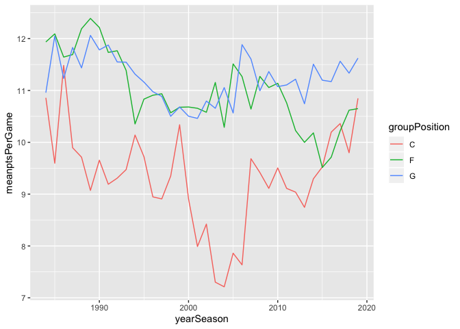<!-- -->

``` r
#also a correlation matrix plot
rcorr <- round(cor(players_post1984_normalized[,c(5:48)]),2)
corrplot(rcorr, method="color")
```

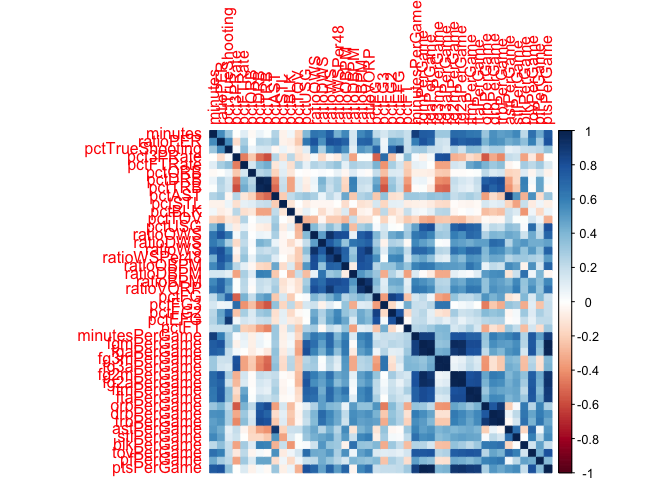<!-- -->

### Missingness

The reasoning behind choosing seasons after 1983 is in part so that we
are not missing any predictors for any observation. For example, the
three point line was introduced in the 79/80 season.

## Looking at PCA (Principal Component Analysis)

PC1 seems to be a case of an “Usage” (-) vs “Non-Usage” (+) battle. In
the negative side, we see characteristics such as ptsPerGame,
fgmPerGame, fg2mPerGame, fg2aPerGame. The other types of variables do
not tend to take on positive values, but the ones that are include:
pctBLK, pctSTL, pctTOV.

Looking at PC2, I would describe this as “Shooters” (-) vs “Baseline”
(+). We see negative values for shooting characteristics, such as
pct3PRate, fg3mPerGame, fg3aPerGame, and positive values for
characteristics typical for tall, big players:pctDRB, pctTRB,
blkPerGame.

``` r
pca <- prcomp(players_post1984_normalized[,-c(1:5, 49)])
d <- as.data.frame(pca$x)
pc1 <- pca$rotation[, 1]
pc1
```

    ##        ratioPER pctTrueShooting       pct3PRate       pctFTRate          pctORB 
    ##   -0.1983005970   -0.1093611304    0.0446114991   -0.0647713332    0.0009161219 
    ##          pctDRB          pctTRB          pctAST          pctSTL          pctBLK 
    ##   -0.0700374947   -0.0607858529   -0.0727580277    0.0245108654    0.0212159135 
    ##          pctTOV          pctUSG        ratioOWS        ratioDWS         ratioWS 
    ##    0.0472907155   -0.1560062675   -0.1734807205   -0.1600089366   -0.1981641340 
    ##    ratioWSPer48       ratioOBPM       ratioDBPM        ratioBPM       ratioVORP 
    ##   -0.1544842420   -0.1718822222   -0.0538801002   -0.1726861352   -0.1729401844 
    ##           pctFG          pctFG3          pctFG2          pctEFG           pctFT 
    ##   -0.0889145670   -0.0305770644   -0.0863343808   -0.0805329326   -0.0432231125 
    ##  minutesPerGame      fgmPerGame      fgaPerGame     fg3mPerGame     fg3aPerGame 
    ##   -0.2998895356   -0.2521327630   -0.2396053072   -0.0744153019   -0.0769013838 
    ##     fg2mPerGame     fg2aPerGame      ftmPerGame      ftaPerGame      orbPerGame 
    ##   -0.2393336867   -0.2379725493   -0.2102740187   -0.2068602535   -0.1238684669 
    ##      drbPerGame      trbPerGame      astPerGame      stlPerGame      blkPerGame 
    ##   -0.1743708911   -0.1668884971   -0.1198521019   -0.1465998170   -0.0812665818 
    ##      tovPerGame       pfPerGame      ptsPerGame 
    ##   -0.2133118488   -0.1379065883   -0.2479709457

``` r
pc2 <- pca$rotation[, 2]
pc2
```

    ##        ratioPER pctTrueShooting       pct3PRate       pctFTRate          pctORB 
    ##     0.008229544     0.025154303    -0.302072212     0.132369578     0.084388721 
    ##          pctDRB          pctTRB          pctAST          pctSTL          pctBLK 
    ##     0.274858386     0.316735159    -0.177544483     0.124695068    -0.239702234 
    ##          pctTOV          pctUSG        ratioOWS        ratioDWS         ratioWS 
    ##     0.046451946    -0.071807006    -0.031764850     0.070089271     0.001804887 
    ##    ratioWSPer48       ratioOBPM       ratioDBPM        ratioBPM       ratioVORP 
    ##     0.037530614    -0.108632785     0.166371704     0.003848704    -0.008176325 
    ##           pctFG          pctFG3          pctFG2          pctEFG           pctFT 
    ##     0.159966530    -0.338672020     0.098603795     0.041321588    -0.147209737 
    ##  minutesPerGame      fgmPerGame      fgaPerGame     fg3mPerGame     fg3aPerGame 
    ##    -0.075582357    -0.059985441    -0.099951216    -0.278630463    -0.289626927 
    ##     fg2mPerGame     fg2aPerGame      ftmPerGame      ftaPerGame      orbPerGame 
    ##     0.016978015    -0.005219723    -0.020993061     0.008195159     0.224811902 
    ##      drbPerGame      trbPerGame      astPerGame      stlPerGame      blkPerGame 
    ##     0.154785859     0.188029191    -0.149428426    -0.109689812     0.152621746 
    ##      tovPerGame       pfPerGame      ptsPerGame 
    ##    -0.053685910     0.133881667    -0.073864587

``` r
d$namePlayer <- players_post1984_normalized$namePlayer
d$isAllNBA <- players_post1984_normalized$isAllNBA
d$yearSeason <- players_post1984_normalized$yearSeason

pcaplot <- ggplot(d, aes(x = PC1, y = PC2)) +
  geom_point(size = .5, alpha = .7) +
  ylab("Shooters vs Baseline") +
  xlab("Usage vs Non-Usage")
pcaplot
```

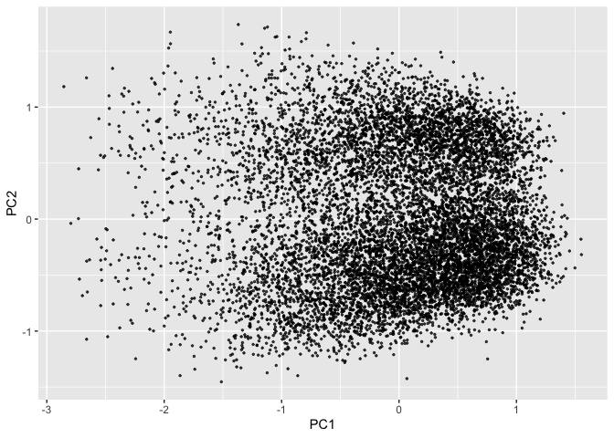<!-- -->

``` r
d1 <- data.frame(PC = 1:43,
                PVE = pca$sdev^2 /
                  sum(pca$sdev^2))

ggplot(d1, aes(x = PC, y = PVE)) +
  geom_line() + 
  geom_point()
```

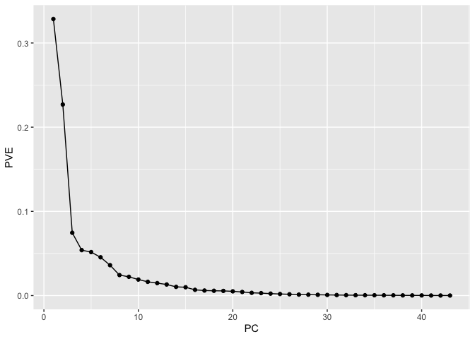<!-- -->

``` r
#some PCA exploration
pcarotations <- data.frame(pca$rotation)
pcarotations$variables <- rownames(pcarotations)
PC1graph <- 
  ggplot(data = pcarotations, mapping = aes(x = variables, y = PC1, 
                                          fill = variables)) +
  geom_col() +
  coord_flip() +
  theme(legend.position = "none") +
  labs(title = "Usage (-) vs Non-Usage (+)")
PC1graph
```

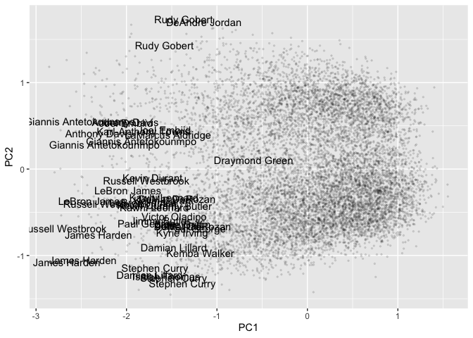<!-- -->

``` r
#note important characteristics: tov, pts, minutes, fgm, fga
PC2graph <- 
  ggplot(data = pcarotations, mapping = aes(x = variables, y = PC2, 
                                          fill = variables)) +
  geom_col() +
  coord_flip() +
  theme(legend.position = "none")+
  labs(title = "Shooters vs Baseline")
PC2graph
```

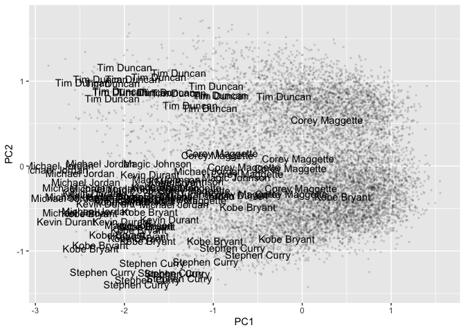<!-- -->

``` r
#note important characteristics: (+) rebounding stats, (-) 3pt shooting, asts
PC3graph <- 
  ggplot(data = pcarotations, mapping = aes(x = variables, y = PC3, 
                                          fill = variables)) +
  geom_col() +
  coord_flip() +
  theme(legend.position = "none")
PC3graph
```

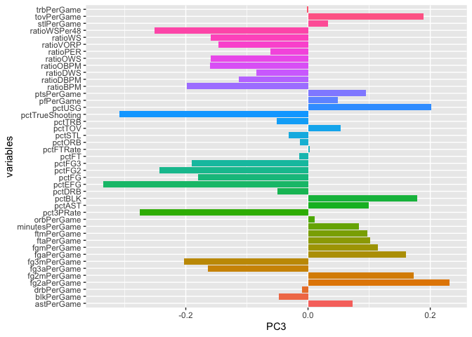<!-- -->

``` r
#idk this one seems pretty hard to interpret lol

#lets now create a plot with some players that we will recognize
currentplayersplot <- ggplot(d, aes(x = PC1, y = PC2)) +
  geom_point(size = .5, alpha = .1) +
  geom_text(data = subset(d, isAllNBA == TRUE & 
                            yearSeason %in% 2017:2019 ),
            aes(label = namePlayer)) +
  ylab("Shooters vs Baseline") +
  xlab("Usage vs Non-Usage")
currentplayersplot
```

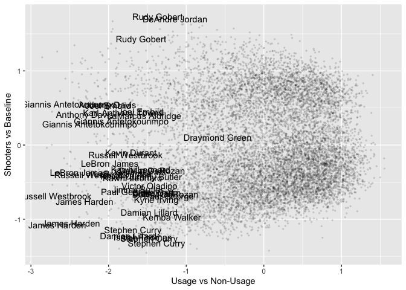<!-- -->

``` r
famousplayersplot <-  ggplot(d, aes(x = PC1, y = PC2)) +
  geom_point(size = .5, alpha = .1) +
  geom_text(data = subset(d, namePlayer %in% c("Lebron James", 
                                               "Michael Jordan",
                                               "Stephen Curry",
                                               "Kobe Bryant",
                                               "Tim Duncan",
                                               "Magic Johnson",
                                               "Kevin Durant")),
            aes(label = namePlayer)) +
  geom_point(color = "purple",
             data = subset(d, namePlayer %in% c("Lebron James", 
                                               "Michael Jordan",
                                               "Stephen Curry",
                                               "Kobe Bryant",
                                               "Tim Duncan",
                                               "Magic Johnson",
                                               "Kevin Durant"),
             size = .5, alpha = .8)) +
  ylab("Shooters vs Baseline") +
  xlab("Usage vs Non-Usage")
famousplayersplot
```

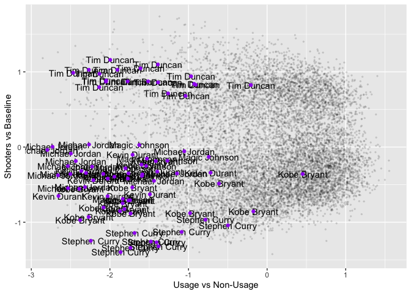<!-- -->

``` r
#animated plot, allstars throughout the seasons
allnbaplayerspca <- d %>%
  filter(isAllNBA == TRUE)
#staticplot
staticplot <- ggplot(data = allnbaplayerspca, 
                     mapping = aes(x = PC1, y = PC2)) +
  geom_point(alpha = .8, color = "purple") + 
  geom_text(data = allnbaplayerspca, mapping = aes(label = namePlayer)) +
  geom_point(data = d, mapping = aes(x = PC1, y = PC2), alpha = .1) +
  ylab("Shooters vs Baseline") +
  xlab("Usage vs Non-Usage")
staticplot
```

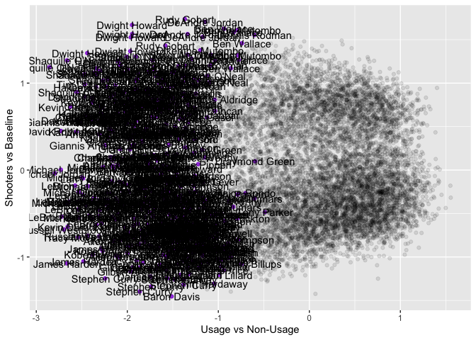<!-- -->

``` r
#byseason
byseasonplot <- staticplot + transition_time(yearSeason) +
  labs(title = "Season: {frame_time}")
animate(byseasonplot, renderer = gifski_renderer(), nframes = 36, fps = 2)
```

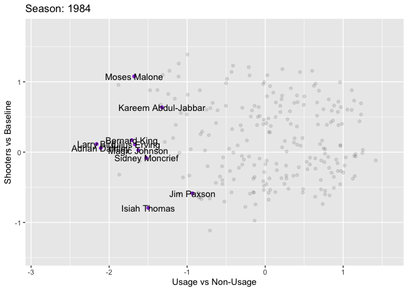<!-- -->

### Variables used:

#### Shooting:

  - pctFTRate: The percentage of total field goal attempts that are Free
    Throws.
  - pct3PRate: The percentage of total field goal attempts that are 3-pt
    shots.
  - pctFG: Field Goal Percentage.
  - pctFG3: Field Goal 3-pt Percentage.
  - pctFG2: Field Goal 2-pt Percentage.
  - pctEFG: Effective Field Goal Percentage. (FGM + (0.5 \* 3PM)/FGA).
    This statistic adjusts for the fact that a 3-pt field goal is worth
    one more point than a regular 2-pt field goal.
  - pctFT: Free Throw Percentage.
  - fgmPerGame: Field Goal Made per Game.
  - fgaPerGame: Field Goal Attempts per game
  - fg3mPerGame: Field Goal Made (3-pt) per game.
  - fg3aPerGame: Field Goal Attempts (3-pt) per game.
  - fg2mPerGame: Field Goal Made (2-pt) per game.
  - fg2aPerGame: Field Goal Attempts (2-pt) per game.
  - ftmPerGame: Free Throws Made per game.
  - ftaPerGame: Free Throw Attempts per game.
  - ptsPerGame: Points per game.

#### Rebounds

  - pctORB: Offensive Rebound Percentage (Rebound Rate).
  - pctTRB: Total Rebound Percentage (Rebound Rate).
  - pctDRB: Deffensive Rebound Percentage (Rebound Rate).
  - orbPerGame: Offensive Rebounds per game.
  - drbPerGame: Deffensive Rebounds per game.
  - trbPerGame: Total Rebounds per game.

#### Passing

  - pctAST: Assists Percentage.
  - pctTOV: Turnover Percentage.
  - astPerGame: Assists per game.
  - tovPerGame: Turnovers per game.

#### Defense

  - pctSTL: Steals percentage.
  - pctBLK: Blocks percentage.
  - stlPerGame: Steals per game.
  - blkPerGame: Blocks per game.
  - pfPerGame: Personal Fouls per game.

#### Efficiency stats

  - ratioPER: Player Efficiency Rating
  - ratioOWS: Offensive Win Shares.
  - ratioDWS: Deffensive Win Shares.
  - ratioWS: Win Shares.
  - ratioWSPer48: Win Shares per 48 minutes.
  - ratioOBPM: Offensive Box Plus/Minus.
  - ratioDBPM: Deffensive Box Plus/Minus.
  - ratioBPM: Box Plus/Minus.
  - ratioVORP: Value Over Replacement Player.
  - minutesPerGame: Minutes Per Game
  - pctUSG: Usage Percentage. (100 \* ((FGA + 0.44 \* FTA + TOV) \* (Tm
    MP / 5)) / (MP \* (Tm FGA + 0.44 \* Tm FTA + Tm TOV))

<!-- end list -->

``` r
#to do: k-means clustering, hierchical clustering
```
