NBA Modern Positions
================

``` r
#load necessary libraries
library(nbastatR)
library(tidyverse)
library(BBmisc)
library(corrplot)
library(gganimate)
library(plotly)
```

## Abstract

## Introduction

### The data

We obtained our datasets from basketball-reference.com and
stats.nba.com. We used the R package `nbastatR` to obtain the data from
those websites.

#### Unit of observation and Variables

Our unit of observation is a player during one season. Our original
dataset consists of 21235 observations and 75 variables, but we’ve
reduced this number to 10223 observations after selecting seasonsafter
1983 and players that have played in at least 600 minutes in the season.
We’ve also taken out some unnecessary variables to make a 11695
observation, 49 variable dataset.

### Variables used:

#### Shooting:

  - pctFTRate: The percentage of total field goal attempts that are Free
    Throws.
  - pct3PRate: The percentage of total field goal attempts that are 3-pt
    shots.
  - pctFG: Field Goal Percentage.
  - pctFG3: Field Goal 3-pt Percentage.
  - pctFG2: Field Goal 2-pt Percentage.
  - pctEFG: Effective Field Goal Percentage. (FGM + (0.5 \* 3PM)/FGA).
    This statistic adjusts for the fact that a 3-pt field goal is worth
    one more point than a regular 2-pt field goal.
  - pctFT: Free Throw Percentage.
  - fgmPerGame: Field Goal Made per Game.
  - fgaPerGame: Field Goal Attempts per game
  - fg3mPerGame: Field Goal Made (3-pt) per game.
  - fg3aPerGame: Field Goal Attempts (3-pt) per game.
  - fg2mPerGame: Field Goal Made (2-pt) per game.
  - fg2aPerGame: Field Goal Attempts (2-pt) per game.
  - ftmPerGame: Free Throws Made per game.
  - ftaPerGame: Free Throw Attempts per game.
  - ptsPerGame: Points per game.

#### Rebounds

  - pctORB: Offensive Rebound Percentage (Rebound Rate).
  - pctTRB: Total Rebound Percentage (Rebound Rate).
  - pctDRB: Deffensive Rebound Percentage (Rebound Rate).
  - orbPerGame: Offensive Rebounds per game.
  - drbPerGame: Deffensive Rebounds per game.
  - trbPerGame: Total Rebounds per game.

#### Passing

  - pctAST: Assists Percentage.
  - pctTOV: Turnover Percentage.
  - astPerGame: Assists per game.
  - tovPerGame: Turnovers per game.

#### Defense

  - pctSTL: Steals percentage.
  - pctBLK: Blocks percentage.
  - stlPerGame: Steals per game.
  - blkPerGame: Blocks per game.
  - pfPerGame: Personal Fouls per game.

#### Efficiency stats

  - ratioPER: Player Efficiency Rating
  - ratioOWS: Offensive Win Shares.
  - ratioDWS: Deffensive Win Shares.
  - ratioWS: Win Shares.
  - ratioWSPer48: Win Shares per 48 minutes.
  - ratioOBPM: Offensive Box Plus/Minus.
  - ratioDBPM: Deffensive Box Plus/Minus.
  - ratioBPM: Box Plus/Minus.
  - ratioVORP: Value Over Replacement Player.
  - minutesPerGame: Minutes Per Game
  - pctUSG: Usage Percentage. (100 \* ((FGA + 0.44 \* FTA + TOV) \* (Tm
    MP / 5)) / (MP \* (Tm FGA + 0.44 \* Tm FTA + Tm TOV))

#### Other

  - namePlayer: Name of player
  - groupPosition: Player Position. Either Guard, Forward, or Center
  - yearSeason: Season year
  - countGames: Games played during season
  - minutes: Minutes played during season
  - isAllNBA: Did player make season’s all NBA team?

<!-- end list -->

``` r
# Gets player stats from 1984 to 2020.
players_post1984 <- bref_players_stats(seasons = 1984:2020, tables = c("advanced", "per_game"), include_all_nba = TRUE, return_message = FALSE)
```

    ## Advanced
    ## Assigning NBA player dictionary to df_dict_nba_players to your environment
    ## PerGame

``` r
# Filters by amount of time they played.
ggplot(players_post1984, mapping = aes(x = minutes)) + 
   geom_histogram() +
   geom_vline(xintercept = 600)
```

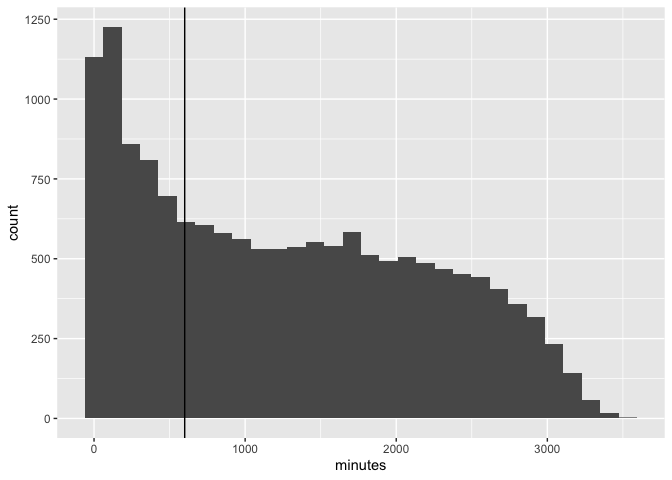<!-- -->

``` r
 players_post1984 <- filter(players_post1984, minutes > 600)

 # Variables to drop
dropping <-c("slugSeason", "idPlayerNBA", "namePlayerBREF", "urlPlayerBREF",
             "slugPlayerBREF", "urlPlayerThumbnail", "urlPlayerHeadshot",
             "slugPosition","urlPlayerPhoto", "urlPlayerStats",
             "urlPlayerActionPhoto","yearSeasonFirst",
             "countTeamsPlayerSeason","countGamesStarted",
             "isSeasonCurrent","slugPlayerSeason", "agePlayer",
             "slugTeamBREF", "isHOFPlayer", "slugTeamsBREF", 
             "countTeamsPlayerSeasonPerGame", "groupAllNBA",
             "numberAllNBATeam", "isAllNBA2", "isAllNBA1",
             "isAllNBA3" )
# Dropping variables
players_post1984 <- players_post1984[,!(names(players_post1984) %in% dropping)]

# Groups players by season, and normalizes by season.
for(year in 1984:2020){
  eval(parse(text = paste( "players_",year," <- filter(players_post1984, yearSeason == ",year,")", sep = "" )))
  for(i in 6:48){
    eval(parse(text = paste( "players_",year,"[,",i,"] <- normalize(players_",year,"[,",i,"],method = 'range', range = c(0,1))", sep = "")))
  }
}

# Ungroups players by season.
players_post1984_normalized <- players_1984
for(year in 1985:2020){
  eval(parse(text = paste( "players_post1984_normalized <- rbind(players_post1984_normalized, players_",year,")", sep = "")))
}
players_post1984_all_nba_normalized <- players_post1984_normalized %>% filter(isAllNBA == TRUE)
```

## Exploratory Data Analysis

``` r
#some summary statistics
summarystatistics1984 <- players_post1984 %>%
  group_by(yearSeason, groupPosition) %>%
  summarize(meanpctFTRate = mean(pctFTRate),
            meanpct3PRate = mean(pct3PRate),
            meanpctFG = mean(pctFG),
            meanpctFG3 = mean(pctFG3),
            meanpctFG2 = mean(pctFG2),
            meanpctEFG = mean(pctEFG),
            meanpctFT = mean(pctFT),
            meanfgmPerGame = mean(fgmPerGame),
            meanfgaPerGame = mean(fgaPerGame),
            meanfg3mPerGame = mean(fg3mPerGame),
            meanfg3aPerGame = mean(fg3aPerGame),
            meanfg2mPerGame = mean(fg2mPerGame),
            meanfg2aPerGame = mean(fg2aPerGame),
            meanftmPerGame = mean(ftmPerGame),
            meanftaPerGame = mean(ftaPerGame),
            meanptsPerGame = mean(ptsPerGame),
            meanpctORB = mean(pctORB),
            meanpctTRB = mean(pctTRB),
            meanpctDRB = mean(pctDRB),
            meanorbPerGame = mean(orbPerGame),
            meandrbPerGame = mean (drbPerGame),
            meantrbPerGame = mean(trbPerGame),
            meanpctAST = mean(pctAST),
            meanpctTOV = mean(pctTOV),
            meanastPerGame = mean(astPerGame),
            meantovPerGame = mean(tovPerGame),
            meanpctSTL = mean(pctSTL),
            meanpctBLK = mean(pctBLK),
            meanstlPerGame = mean(stlPerGame),
            meanblkPerGame = mean(blkPerGame),
            meanpfPerGame = mean(pfPerGame),
            meanratioOWS = mean(ratioOWS),
            meanratioDWS = mean(ratioDWS),
            meanratioWS = mean(ratioWS),
            meanratioWSPer48 = mean(ratioWSPer48),
            meanratioOBPM = mean(ratioOBPM),
            meanratioDBPM = mean(ratioDBPM),
            meanratioBPM = mean(ratioBPM),
            meanratioVORP = mean(ratioVORP),
            sdpctFTRate = sd(pctFTRate),
            sdpct3PRate = sd(pct3PRate),
            sdpctFG = sd(pctFG),
            sdpctFG3 = sd(pctFG3),
            sdpctFG2 = sd(pctFG2),
            sdpctEFG = sd(pctEFG),
            sdpctFT = sd(pctFT),
            sdfgmPerGame = sd(fgmPerGame),
            sdfgaPerGame = sd(fgaPerGame),
            sdfg3mPerGame = sd(fg3mPerGame),
            sdfg3aPerGame = sd(fg3aPerGame),
            sdfg2mPerGame = sd(fg2mPerGame),
            sdfg2aPerGame = sd(fg2aPerGame),
            sdftmPerGame = sd(ftmPerGame),
            sdftaPerGame = sd(ftaPerGame),
            sdptsPerGame = sd(ptsPerGame),
            sdpctORB = sd(pctORB),
            sdpctTRB = sd(pctTRB),
            sdpctDRB = sd(pctDRB),
            sdorbPerGame = sd(orbPerGame),
            sddrbPerGame = sd (drbPerGame),
            sdtrbPerGame = sd(trbPerGame),
            sdpctSTL = sd(pctSTL),
            sdpctBLK = sd(pctBLK),
            sdstlPerGame = sd(stlPerGame),
            sdblkPerGame = sd(blkPerGame),
            sdpfPerGame = sd(pfPerGame),
            sdratioOWS = sd(ratioOWS),
            sdratioDWS = sd(ratioDWS),
            sdratioWS = sd(ratioWS),
            sdratioWSPer48 = sd(ratioWSPer48),
            sdratioOBPM = sd(ratioOBPM),
            sdratioDBPM = sd(ratioDBPM),
            sdratioBPM = sd(ratioBPM),
            sdratioVORP = sd(ratioVORP)
            )
head(summarystatistics1984)
```

    ## # A tibble: 6 x 76
    ## # Groups:   yearSeason [2]
    ##   yearSeason groupPosition meanpctFTRate meanpct3PRate meanpctFG meanpctFG3
    ##        <dbl> <chr>                 <dbl>         <dbl>     <dbl>      <dbl>
    ## 1       1984 C                     0.394       0.00437     0.512     0.0709
    ## 2       1984 F                     0.366       0.0154      0.494     0.128 
    ## 3       1984 G                     0.292       0.0497      0.470     0.215 
    ## 4       1985 C                     0.406       0.00487     0.505     0.0232
    ## 5       1985 F                     0.348       0.0202      0.490     0.129 
    ## 6       1985 G                     0.274       0.0665      0.478     0.239 
    ## # … with 70 more variables: meanpctFG2 <dbl>, meanpctEFG <dbl>,
    ## #   meanpctFT <dbl>, meanfgmPerGame <dbl>, meanfgaPerGame <dbl>,
    ## #   meanfg3mPerGame <dbl>, meanfg3aPerGame <dbl>, meanfg2mPerGame <dbl>,
    ## #   meanfg2aPerGame <dbl>, meanftmPerGame <dbl>, meanftaPerGame <dbl>,
    ## #   meanptsPerGame <dbl>, meanpctORB <dbl>, meanpctTRB <dbl>, meanpctDRB <dbl>,
    ## #   meanorbPerGame <dbl>, meandrbPerGame <dbl>, meantrbPerGame <dbl>,
    ## #   meanpctAST <dbl>, meanpctTOV <dbl>, meanastPerGame <dbl>,
    ## #   meantovPerGame <dbl>, meanpctSTL <dbl>, meanpctBLK <dbl>,
    ## #   meanstlPerGame <dbl>, meanblkPerGame <dbl>, meanpfPerGame <dbl>,
    ## #   meanratioOWS <dbl>, meanratioDWS <dbl>, meanratioWS <dbl>,
    ## #   meanratioWSPer48 <dbl>, meanratioOBPM <dbl>, meanratioDBPM <dbl>,
    ## #   meanratioBPM <dbl>, meanratioVORP <dbl>, sdpctFTRate <dbl>,
    ## #   sdpct3PRate <dbl>, sdpctFG <dbl>, sdpctFG3 <dbl>, sdpctFG2 <dbl>,
    ## #   sdpctEFG <dbl>, sdpctFT <dbl>, sdfgmPerGame <dbl>, sdfgaPerGame <dbl>,
    ## #   sdfg3mPerGame <dbl>, sdfg3aPerGame <dbl>, sdfg2mPerGame <dbl>,
    ## #   sdfg2aPerGame <dbl>, sdftmPerGame <dbl>, sdftaPerGame <dbl>,
    ## #   sdptsPerGame <dbl>, sdpctORB <dbl>, sdpctTRB <dbl>, sdpctDRB <dbl>,
    ## #   sdorbPerGame <dbl>, sddrbPerGame <dbl>, sdtrbPerGame <dbl>, sdpctSTL <dbl>,
    ## #   sdpctBLK <dbl>, sdstlPerGame <dbl>, sdblkPerGame <dbl>, sdpfPerGame <dbl>,
    ## #   sdratioOWS <dbl>, sdratioDWS <dbl>, sdratioWS <dbl>, sdratioWSPer48 <dbl>,
    ## #   sdratioOBPM <dbl>, sdratioDBPM <dbl>, sdratioBPM <dbl>, sdratioVORP <dbl>

``` r
ggplot(data = summarystatistics1984, mapping = aes(x = yearSeason, y = meanpctFG, color = groupPosition)) + 
  geom_line()
```

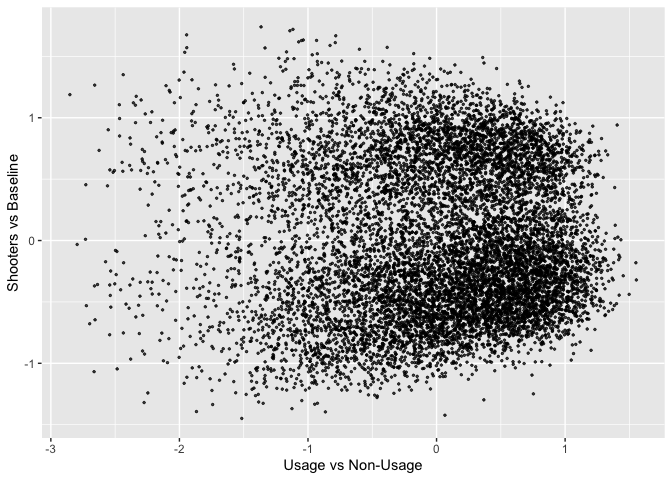<!-- -->

``` r
#taking a look at some stats over time, grouped by year and position
#fg pct
ggplot(data = summarystatistics1984, 
       mapping = aes(x = yearSeason, y = meanpctFG, color = groupPosition)) +  geom_line()
```

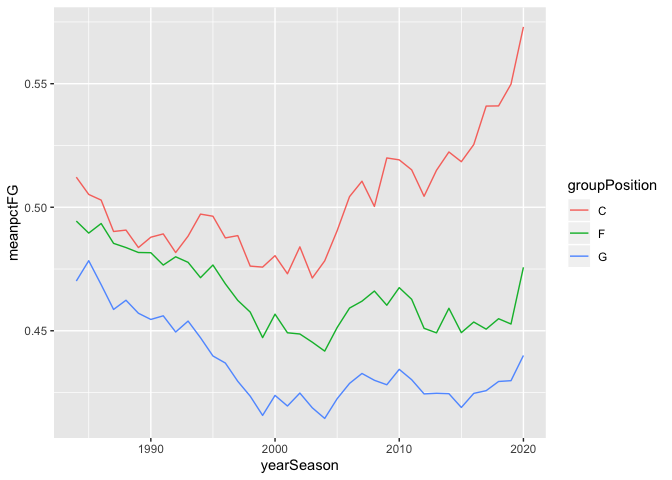<!-- -->

``` r
#3FGPct, see the introduction of 3 point line
ggplot(data = summarystatistics1984, 
       mapping = aes(x = yearSeason, y = meanpctFG3,
                     color = groupPosition)) +
  geom_line()
```

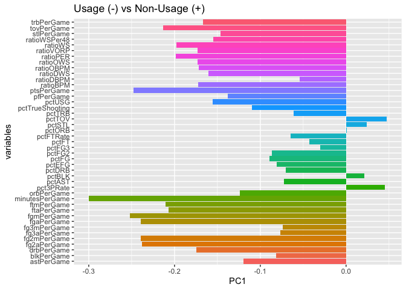<!-- -->

``` r
#meanFGM
ggplot(data = summarystatistics1984, 
       mapping = aes(x = yearSeason, y = meanfgmPerGame,
                     color = groupPosition)) +
  geom_line()
```

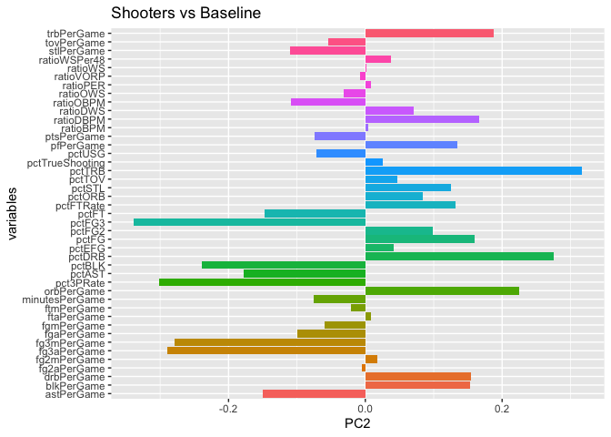<!-- -->

``` r
#meanFGA
ggplot(data = summarystatistics1984, 
       mapping = aes(x = yearSeason, y = meanfgaPerGame,
                     color = groupPosition)) +
  geom_line()
```

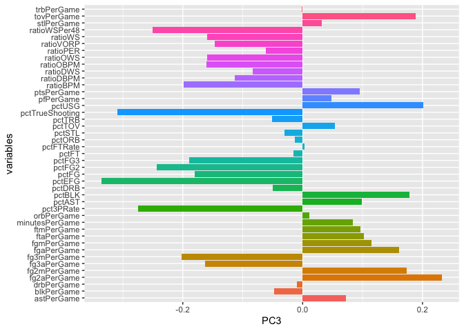<!-- -->

``` r
#mean3FGM 
ggplot(data = summarystatistics1984, 
       mapping = aes(x = yearSeason, y = meanfg3mPerGame,
                     color = groupPosition)) +
  geom_line()
```

<!-- -->

``` r
#mean3FGA
ggplot(data = summarystatistics1984, 
       mapping = aes(x = yearSeason, y = meanfg3aPerGame, color = groupPosition)) +
  geom_line()
```

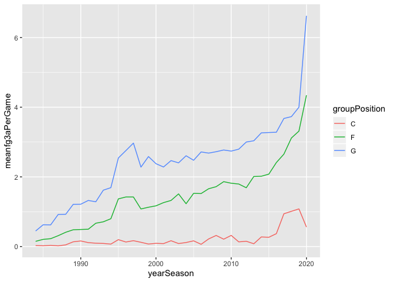<!-- -->

``` r
#meanFTA
ggplot(data = summarystatistics1984, 
       mapping = aes(x = yearSeason, y = meanftaPerGame, 
                     color = groupPosition)) +
  geom_line()
```

<!-- -->

``` r
#meanFTM
ggplot(data = summarystatistics1984, 
       mapping = aes(x = yearSeason, y = meanftmPerGame,
                     color = groupPosition)) +
  geom_line()
```

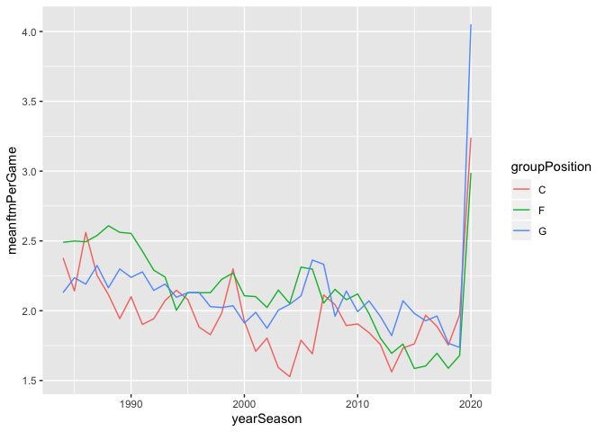<!-- -->

``` r
#meanORB
ggplot(data = summarystatistics1984, 
       mapping = aes(x = yearSeason, y = meanorbPerGame,
                     color = groupPosition)) +
  geom_line()
```

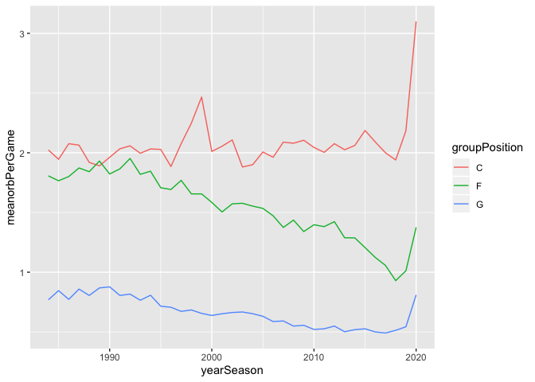<!-- -->

``` r
#meanDRB
ggplot(data = summarystatistics1984, 
       mapping = aes(x = yearSeason, y = meandrbPerGame,
                     color = groupPosition)) +
  geom_line()
```

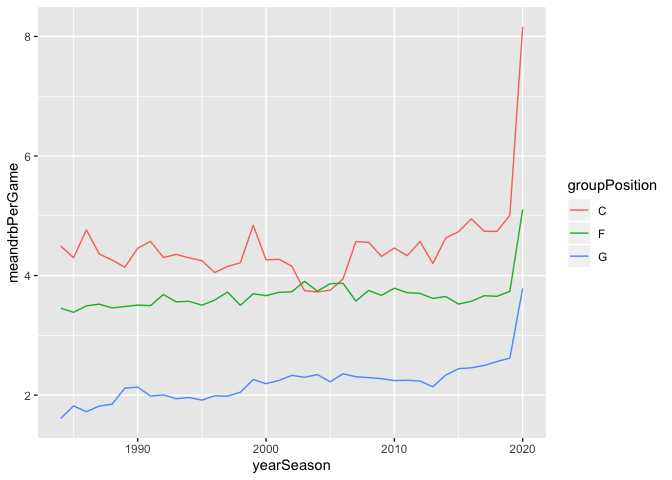<!-- -->

``` r
#meanAST
ggplot(data = summarystatistics1984, 
       mapping = aes(x = yearSeason, y = meanastPerGame, 
                     color = groupPosition)) +
  geom_line()
```

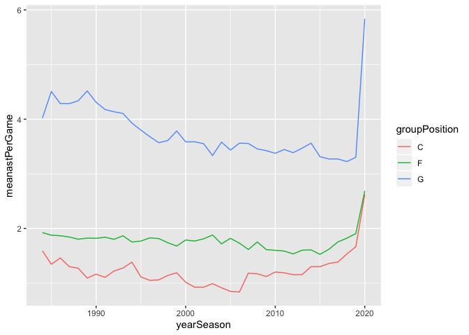<!-- -->

``` r
#meanSTL
ggplot(data = summarystatistics1984, 
       mapping = aes(x = yearSeason, y = meanstlPerGame,
                     color = groupPosition)) +
  geom_line()
```

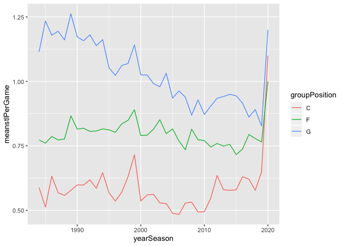<!-- -->

``` r
#meanBLK
ggplot(data = summarystatistics1984, 
       mapping = aes(x = yearSeason, y = meanblkPerGame,
                     color = groupPosition)) +
  geom_line()
```

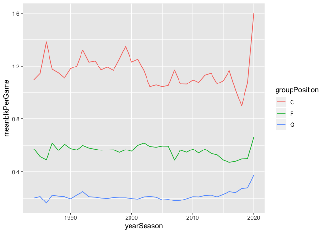<!-- -->

``` r
#meanTOV
ggplot(data = summarystatistics1984, 
       mapping = aes(x = yearSeason, y = meantovPerGame, 
                     color = groupPosition)) +
  geom_line()
```

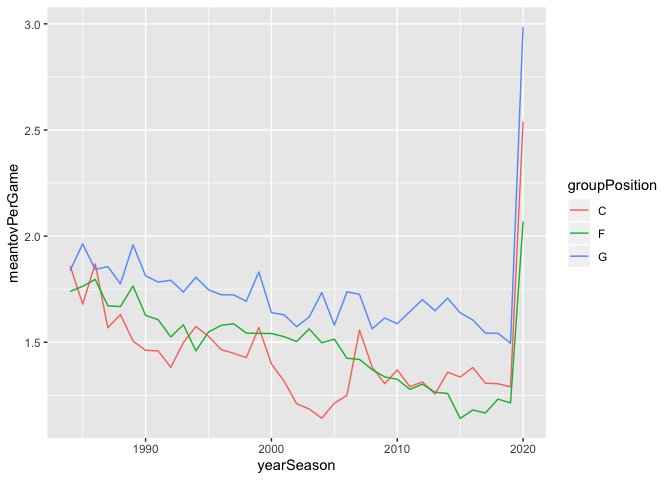<!-- -->

``` r
#meanPTS
ggplot(data = summarystatistics1984, 
       mapping = aes(x = yearSeason, y = meanptsPerGame,
                     color = groupPosition)) +
  geom_line()
```

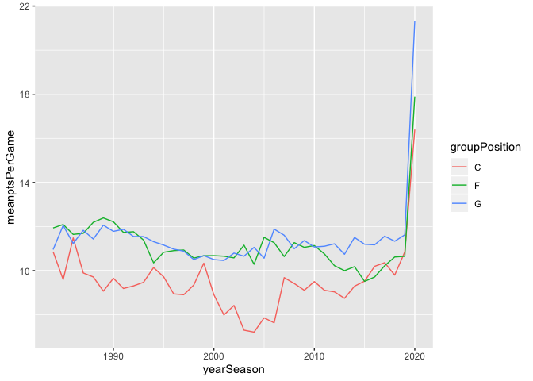<!-- -->

``` r
#also a correlation matrix plot
rcorr <- round(cor(players_post1984_normalized[,c(5:48)]),2)
corrplot(rcorr, method="color")
```

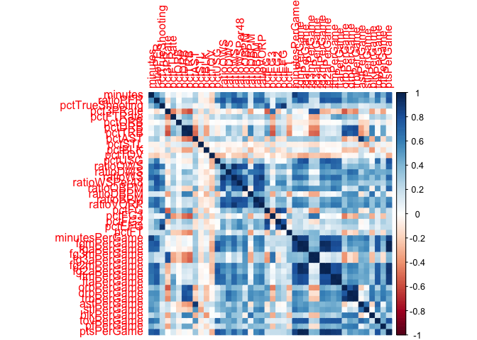<!-- -->

## Modeling

``` r
pca <- prcomp(players_post1984_normalized[,-c(1:5, 49)])
d <- as.data.frame(pca$x)
pc1 <- pca$rotation[, 1]
pc1
```

    ##        ratioPER pctTrueShooting       pct3PRate       pctFTRate          pctORB 
    ##   -0.1983625651   -0.1096560289    0.0450415240   -0.0645939906    0.0008473103 
    ##          pctDRB          pctTRB          pctAST          pctSTL          pctBLK 
    ##   -0.0703342253   -0.0610925823   -0.0726174793    0.0243398447    0.0213361996 
    ##          pctTOV          pctUSG        ratioOWS        ratioDWS         ratioWS 
    ##    0.0473415150   -0.1558420993   -0.1733695953   -0.1601178810   -0.1980718041 
    ##    ratioWSPer48       ratioOBPM       ratioDBPM        ratioBPM       ratioVORP 
    ##   -0.1545547328   -0.1716825298   -0.0541296497   -0.1727587240   -0.1730167817 
    ##           pctFG          pctFG3          pctFG2          pctEFG           pctFT 
    ##   -0.0890130179   -0.0301497723   -0.0867476037   -0.0808641061   -0.0431294379 
    ##  minutesPerGame      fgmPerGame      fgaPerGame     fg3mPerGame     fg3aPerGame 
    ##   -0.2998802496   -0.2520598913   -0.2393978475   -0.0740288563   -0.0765422662 
    ##     fg2mPerGame     fg2aPerGame      ftmPerGame      ftaPerGame      orbPerGame 
    ##   -0.2394002954   -0.2379954877   -0.2101622791   -0.2067910575   -0.1241007495 
    ##      drbPerGame      trbPerGame      astPerGame      stlPerGame      blkPerGame 
    ##   -0.1745598419   -0.1670796551   -0.1197270166   -0.1465014745   -0.0814533718 
    ##      tovPerGame       pfPerGame      ptsPerGame 
    ##   -0.2132481504   -0.1380382641   -0.2477798647

``` r
pc2 <- pca$rotation[, 2]
pc2
```

    ##        ratioPER pctTrueShooting       pct3PRate       pctFTRate          pctORB 
    ##     0.008093201     0.024866603    -0.302265875     0.133036994     0.084371147 
    ##          pctDRB          pctTRB          pctAST          pctSTL          pctBLK 
    ##     0.274526380     0.316509190    -0.177338898     0.124483178    -0.239434465 
    ##          pctTOV          pctUSG        ratioOWS        ratioDWS         ratioWS 
    ##     0.047242354    -0.072037142    -0.031801400     0.070104565     0.001781529 
    ##    ratioWSPer48       ratioOBPM       ratioDBPM        ratioBPM       ratioVORP 
    ##     0.037530607    -0.108601969     0.166454069     0.003709114    -0.008387688 
    ##           pctFG          pctFG3          pctFG2          pctEFG           pctFT 
    ##     0.160038194    -0.338814126     0.098377219     0.041200109    -0.147541566 
    ##  minutesPerGame      fgmPerGame      fgaPerGame     fg3mPerGame     fg3aPerGame 
    ##    -0.076328842    -0.060422390    -0.100476045    -0.278753652    -0.289747933 
    ##     fg2mPerGame     fg2aPerGame      ftmPerGame      ftaPerGame      orbPerGame 
    ##     0.016693261    -0.005611984    -0.021097180     0.008074360     0.224529869 
    ##      drbPerGame      trbPerGame      astPerGame      stlPerGame      blkPerGame 
    ##     0.154532789     0.187831955    -0.149386934    -0.109607878     0.152575475 
    ##      tovPerGame       pfPerGame      ptsPerGame 
    ##    -0.053767182     0.133413899    -0.074140031

``` r
pca3 <- pca$rotation[, 3]
d$namePlayer <- players_post1984_normalized$namePlayer
d$isAllNBA <- players_post1984_normalized$isAllNBA
d$yearSeason <- players_post1984_normalized$yearSeason

pcaplot <- ggplot(d, aes(x = PC1, y = PC2)) +
  geom_point(size = .5, alpha = .7) +
  ylab("Shooters vs Baseline") +
  xlab("Usage vs Non-Usage")
pcaplot
```

<!-- -->

``` r
d1 <- tibble(PC = 1:43,
                PVE = pca$sdev^2 /
                  sum(pca$sdev^2))

ggplot(d1, aes(x = PC, y = PVE)) +
  geom_line() + 
  geom_point()
```

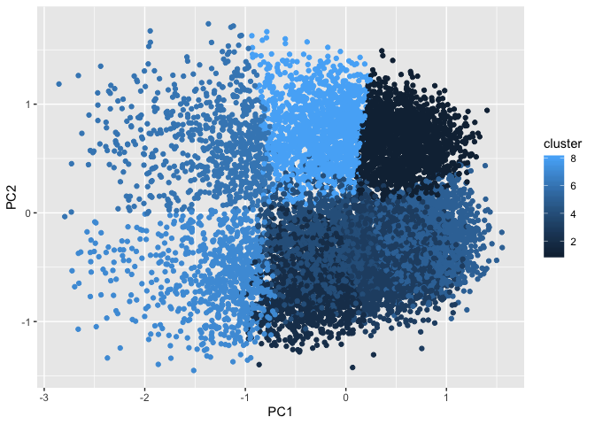<!-- -->

``` r
#some PCA exploration
pca_rotations <- data.frame(pca$rotation)
pca_rotations$variables <- rownames(pca_rotations)
PC1graph <- 
  ggplot(data = pca_rotations, mapping = aes(x = variables, y = PC1, 
                                          fill = variables)) +
  geom_col() +
  coord_flip() +
  theme(legend.position = "none") +
  labs(title = "Usage (-) vs Non-Usage (+)")
PC1graph
```

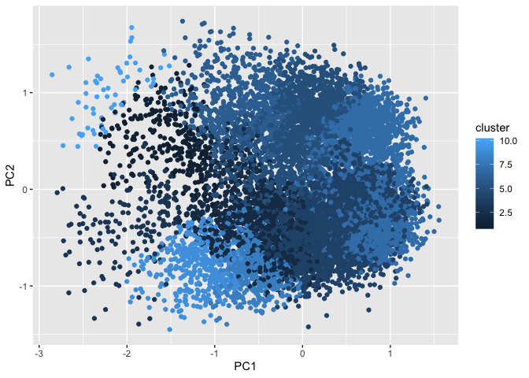<!-- -->

``` r
#note important characteristics: tov, pts, minutes, fgm, fga
PC2graph <- 
  ggplot(data = pca_rotations, mapping = aes(x = variables, y = PC2, 
                                          fill = variables)) +
  geom_col() +
  coord_flip() +
  theme(legend.position = "none")+
  labs(title = "Shooters vs Baseline")
PC2graph
```

<!-- -->

``` r
#note important characteristics: (+) rebounding stats, (-) 3pt shooting, asts
PC3graph <- 
  ggplot(data = pca_rotations, mapping = aes(x = variables, y = PC3, 
                                          fill = variables)) +
  geom_col() +
  coord_flip() +
  theme(legend.position = "none")
PC3graph
```

<!-- -->

``` r
#important characteristics: (+) turnovers, usage, field goals worth 2
#                            (-) True shooting, EFG, 3 pointers

#lets now create a plot with some players that we will recognize
currentplayersplot <- ggplot(d, aes(x = PC1, y = PC2)) +
  geom_point(size = .5, alpha = .1) +
  geom_text(data = subset(d, isAllNBA == TRUE & 
                            yearSeason %in% 2017:2019 ),
            aes(label = namePlayer)) +
  ylab("Shooters vs Baseline") +
  xlab("Usage vs Non-Usage")
currentplayersplot
```

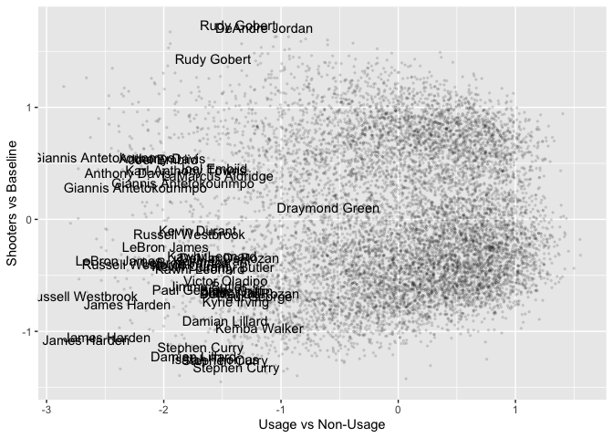<!-- -->

``` r
famousplayersplot <-  ggplot(d, aes(x = PC1, y = PC2)) +
  geom_point(size = .5, alpha = .1) +
  geom_text(data = subset(d, namePlayer %in% c("Lebron James", 
                                               "Michael Jordan",
                                               "Stephen Curry",
                                               "Kobe Bryant",
                                               "Tim Duncan",
                                               "Magic Johnson",
                                               "Kevin Durant")),
            aes(label = namePlayer)) +
  geom_point(color = "purple",
             data = subset(d, namePlayer %in% c("Lebron James", 
                                               "Michael Jordan",
                                               "Stephen Curry",
                                               "Kobe Bryant",
                                               "Tim Duncan",
                                               "Magic Johnson",
                                               "Kevin Durant"),
             size = .5, alpha = .8)) +
  ylab("Shooters vs Baseline") +
  xlab("Usage vs Non-Usage")
famousplayersplot
```

<!-- -->

``` r
#animated plot, allstars throughout the seasons
allnbaplayerspca <- d %>%
  filter(isAllNBA == TRUE)
#staticplot
staticplot <- ggplot(data = allnbaplayerspca, 
                     mapping = aes(x = PC1, y = PC2)) +
  geom_point(alpha = .8, color = "purple") + 
  geom_text(data = allnbaplayerspca, mapping = aes(label = namePlayer)) +
  geom_point(data = d, mapping = aes(x = PC1, y = PC2), alpha = .1) +
  ylab("Shooters vs Baseline") +
  xlab("Usage vs Non-Usage")
staticplot
```

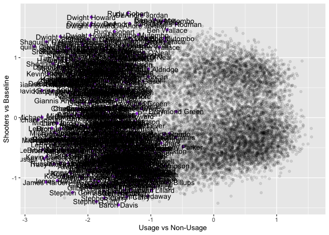<!-- -->

``` r
#byseason
byseasonplot <- staticplot + transition_time(yearSeason) +
  labs(title = "Season: {frame_time}")
animate(byseasonplot, renderer = gifski_renderer(), nframes = 36, fps = 2)
```

<!-- -->

``` r
n_pcas <- as_tibble(pca$x[,1:3])
n_clusters_kmeans<-kmeans(n_pcas, centers = 3)
n_clusters_hier<-hclust(dist(n_pcas))
n_clusters_hier_plot<-plot(n_clusters_hier)
```

<!-- -->

``` r
n_clusters_hier_cut <- cutree(n_clusters_hier, 3)

n_pcas_kmeans <- n_pcas %>% mutate(cluster = n_clusters_kmeans$cluster)
n_pcas_hier <- n_pcas %>% mutate(cluster = n_clusters_hier_cut)

ggplot(n_pcas_kmeans, aes(x = PC1, y = PC2, color = cluster)) + geom_point()
```

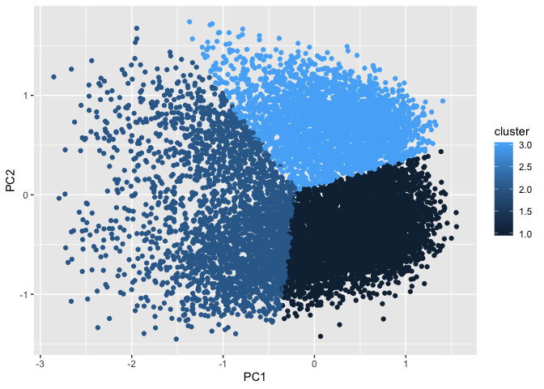<!-- -->

``` r
ggplot(n_pcas_hier, aes(x = PC1, y = PC2, color = cluster)) + geom_point()
```

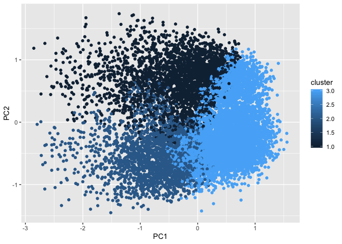<!-- -->

``` r
#plot_ly(n_pcas_hier, x = ~PC1, y = ~PC2, z = ~PC3, color = ~cluster)

players_post1984_pca_clusters <- players_post1984 %>% 
  mutate(PC1 = pca$x[,1], PC2 = pca$x[,2], PC3 = pca$x[,3],
         hier_cluster = n_clusters_hier_cut, kmeans_cluster = n_clusters_kmeans$cluster)
players_post1984_pca_clusters_year <- players_post1984_pca_clusters %>% 
  group_by(yearSeason, hier_cluster) %>% count

players_post1984_pca_year <- players_post1984_pca_clusters %>% 
  group_by(yearSeason) %>% count
players_post1984_pca_clusters_year_1 <- players_post1984_pca_clusters_year %>%
  filter(hier_cluster == 1)
players_post1984_pca_clusters_year_2 <- players_post1984_pca_clusters_year %>%
  filter(hier_cluster == 2)
players_post1984_pca_clusters_year_3 <- players_post1984_pca_clusters_year %>%
  filter(hier_cluster == 3)

cluster_proportions_1 = players_post1984_pca_clusters_year_1$n/players_post1984_pca_year$n
cluster_proportions_2 = players_post1984_pca_clusters_year_2$n/players_post1984_pca_year$n
cluster_proportions_3 = players_post1984_pca_clusters_year_3$n/players_post1984_pca_year$n
cluster_proportions <- tibble(year = c(1984:2020), one = cluster_proportions_1, two = cluster_proportions_2, three = cluster_proportions_3)

ggplot(cluster_proportions, aes(x = year, y = one), color = "red")+geom_line()+
  geom_line(aes(x = year, y = two), color = "blue")+
  geom_line(aes(x = year, y = three), color = "yellow")
```

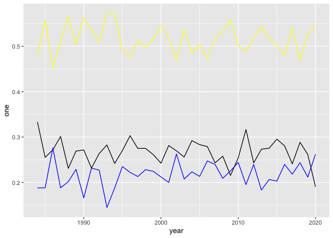<!-- -->

``` r
players_post1984_pca_clusters_year
```

    ## # A tibble: 111 x 3
    ## # Groups:   yearSeason, hier_cluster [111]
    ##    yearSeason hier_cluster     n
    ##         <dbl>        <int> <int>
    ##  1       1984            1    78
    ##  2       1984            2    44
    ##  3       1984            3   112
    ##  4       1985            1    61
    ##  5       1985            2    45
    ##  6       1985            3   133
    ##  7       1986            1    65
    ##  8       1986            2    66
    ##  9       1986            3   108
    ## 10       1987            1    72
    ## # … with 101 more rows

``` r
pca_all_nba <- prcomp(players_post1984_all_nba_normalized[,-c(1:5, 49)])
d_all_nba <- as.data.frame(pca_all_nba$x)

ggplot(d, aes(x = PC1, y = PC2)) +
  geom_point(size = .5, alpha = .7)
```

<!-- -->

``` r
d2 <- tibble(PC = 1:43,
                PVE = pca$sdev^2 /
                  sum(pca$sdev^2))

ggplot(d2, aes(x = PC, y = PVE)) +
  geom_line() + 
  geom_point()
```

<!-- -->

``` r
pca_all_nba_rotations <- data.frame(pca_all_nba$rotation)
pca_all_nba_rotations$variables <- rownames(pca_all_nba_rotations)

PC1_all_nba_graph <- 
  ggplot(data = pca_all_nba_rotations, mapping = aes(x = variables, y = PC1, 
                                          fill = variables)) +
  geom_col()+
  coord_flip()+
  theme(legend.position = "none")
PC1_all_nba_graph
```

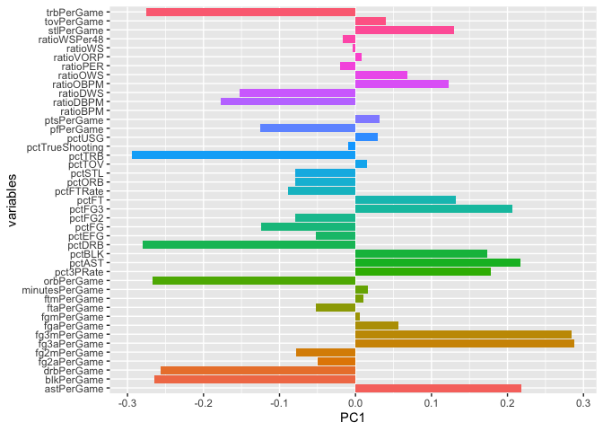<!-- -->

``` r
PC2_all_nba_graph <- 
  ggplot(data = pca_all_nba_rotations, mapping = aes(x = variables, y = PC2, 
                                          fill = variables)) +
  geom_col()+
  coord_flip()+
  theme(legend.position = "none")
PC2_all_nba_graph
```

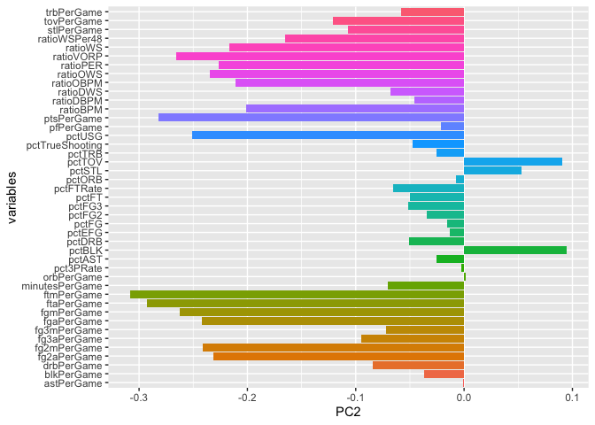<!-- -->

``` r
PC3_all_nba_graph <- 
  ggplot(data = pca_all_nba_rotations, mapping = aes(x = variables, y = PC3, 
                                          fill = variables)) +
  geom_col()+
  coord_flip()+
  theme(legend.position = "none")
PC3_all_nba_graph
```

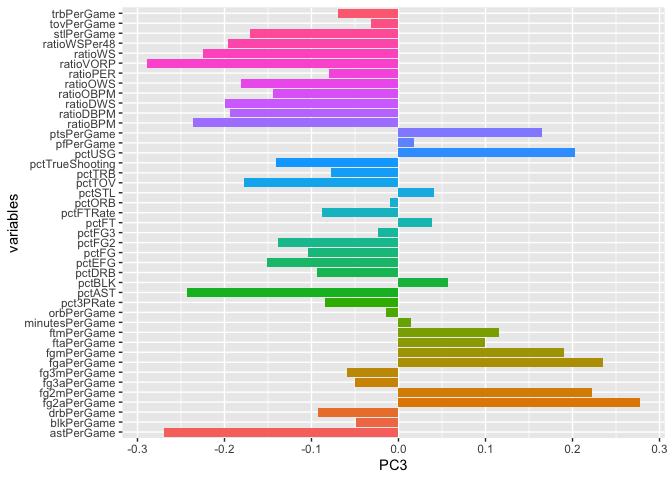<!-- -->

``` r
PC4_all_nba_graph <- 
  ggplot(data = pca_all_nba_rotations, mapping = aes(x = variables, y = PC4, 
                                          fill = variables)) +
  geom_col()+
  coord_flip()+
  theme(legend.position = "none")
PC4_all_nba_graph
```

<!-- -->

``` r
n_pcas_all_nba <- as_tibble(pca_all_nba$x[,1:3])
n_clusters_kmeans_all_nba <-kmeans(n_pcas_all_nba, centers = 3)
n_clusters_hier_all_nba <-hclust(dist(n_pcas_all_nba))
n_clusters_hier_plot_all_nba<-plot(n_clusters_hier_all_nba)
```

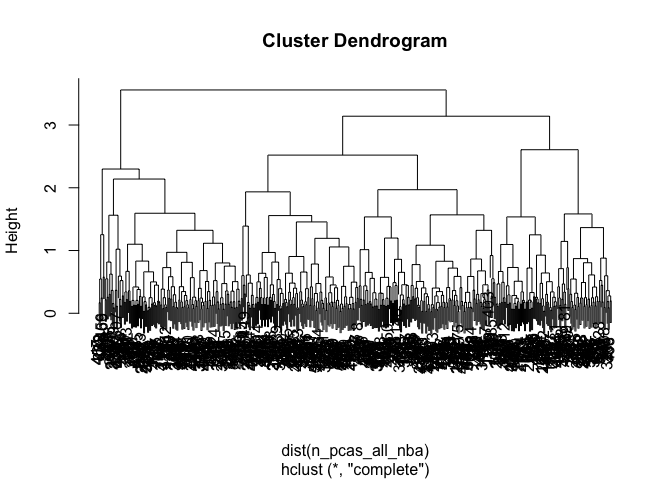<!-- -->

``` r
n_clusters_hier_cut_all_nba <- cutree(n_clusters_hier_all_nba, 3)

n_pcas_kmeans_all_nba <- n_pcas_all_nba %>% mutate(cluster = n_clusters_kmeans_all_nba$cluster)
n_pcas_hier_all_nba <- n_pcas_all_nba %>% mutate(cluster = n_clusters_hier_cut_all_nba)

ggplot(n_pcas_kmeans_all_nba, aes(x = PC1, y = PC2, color = cluster)) + geom_point()
```

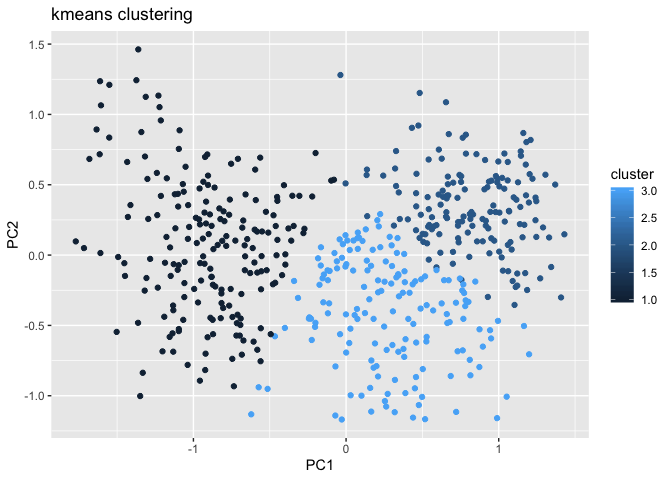<!-- -->

``` r
ggplot(n_pcas_hier_all_nba, aes(x = PC1, y = PC2, color = cluster)) + geom_point()
```

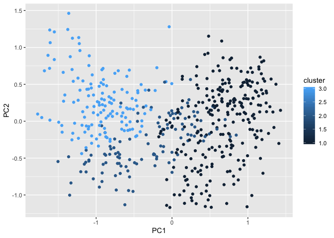<!-- -->

``` r
#plot_ly(n_pcas_hier_all_nba, x = ~PC1, y = ~PC2, z = ~PC3, color = ~cluster)

players_post1984_pca_clusters_all_nba <- players_post1984_all_nba_normalized %>% 
  mutate(PC1 = pca_all_nba$x[,1], PC2 = pca_all_nba$x[,2], PC3 = pca_all_nba$x[,3],
         hier_cluster = n_clusters_hier_cut_all_nba, kmeans_cluster = n_clusters_kmeans_all_nba$cluster)
players_post1984_pca_clusters_year_all_nba <- players_post1984_pca_clusters_all_nba %>% 
  group_by(yearSeason, hier_cluster) %>% count

players_post1984_pca_year_all_nba <- players_post1984_pca_clusters_all_nba %>% 
  group_by(yearSeason) %>% count
players_post1984_pca_clusters_year_1_all_nba <- players_post1984_pca_clusters_year_all_nba %>%
  filter(hier_cluster == 1)
players_post1984_pca_clusters_year_2_all_nba <- players_post1984_pca_clusters_year_all_nba %>%
  filter(hier_cluster == 2)
players_post1984_pca_clusters_year_3_all_nba <- players_post1984_pca_clusters_year_all_nba %>%
  filter(hier_cluster == 3)

cluster_proportions_1_all_nba = players_post1984_pca_clusters_year_1_all_nba$n/players_post1984_pca_year_all_nba$n
cluster_proportions_2_all_nba = players_post1984_pca_clusters_year_2_all_nba$n/players_post1984_pca_year_all_nba$n
cluster_proportions_3_all_nba = players_post1984_pca_clusters_year_3_all_nba$n/players_post1984_pca_year_all_nba$n

cluster_proportions_all_nba <- tibble(year = c(1984:2019), one = cluster_proportions_1_all_nba, two = cluster_proportions_2_all_nba, three = cluster_proportions_3_all_nba)

ggplot(cluster_proportions_all_nba, aes(x = year, y = one))+geom_line(color = "red")+
  geom_line(aes(x = year, y = two), color = "blue")+
  geom_line(aes(x = year, y = three), color = "green")
```

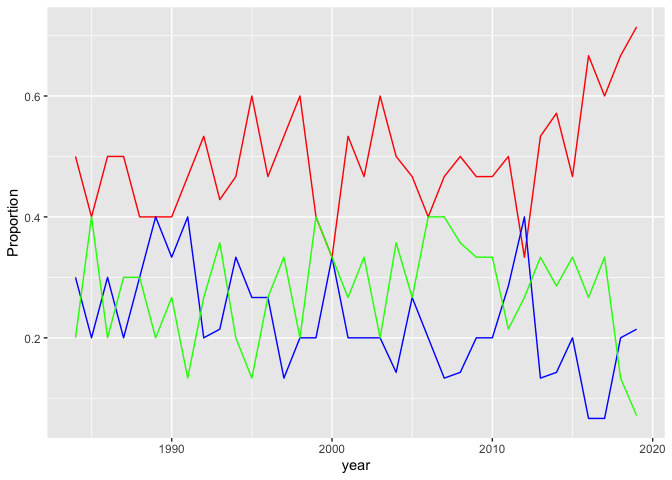<!-- -->

## Discussion

### Looking at PCA (Principal Component Analysis)

PC1 seems to be a case of an “Usage” (-) vs “Non-Usage” (+) battle. In
the negative side, we see characteristics such as ptsPerGame,
fgmPerGame, fg2mPerGame, fg2aPerGame. The other types of variables do
not tend to take on positive values, but the ones that are include:
pctBLK, pctSTL, pctTOV.  
Looking at PC2, I would describe this as “Shooters” (-) vs “Baseline”
(+). We see negative values for shooting characteristics, such as
pct3PRate, fg3mPerGame, fg3aPerGame, and positive values for
characteristics typical for tall, big players:pctDRB, pctTRB,
blkPerGame. PC3 is the distinction between “Outside the Arc” (-) and
“Inside the Arc” (+) Extreme negative values appear for
pctTrueShooting, pctEFG, pct3PRate. On the positive side, we see
tovPerGame, pctUSG, pctBLK, and fg2aPerGame.

## References
